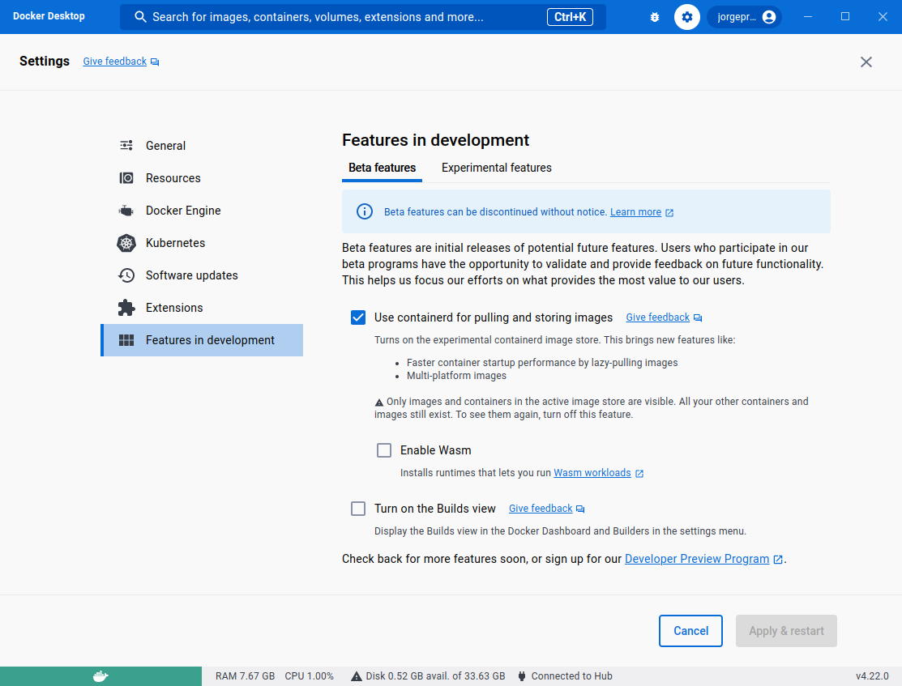

# docker-desktop-shim-manager

A container image to install and uninstall WebAssembly shims in Docker Desktop.

## Usage

Make sure to enable "Use containerd for pulling and storing images" in the Docker Desktop settings.



Then from a terminal run

```bash
alias dd-shim-mngr="docker run --rm -i --privileged --pid=host jorgeprendes420/docker-desktop-shim-manager:latest"
dd-shim-mngr help # show help
dd-shim-mngr ls # list all available wasm shims
dd-shim-mngr install latest # install latest upstream shims
```
